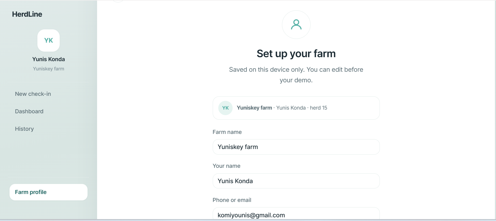
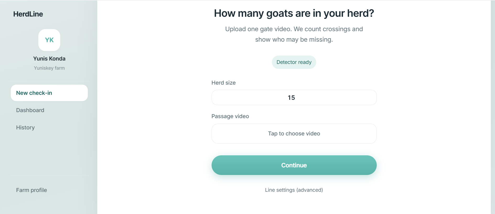
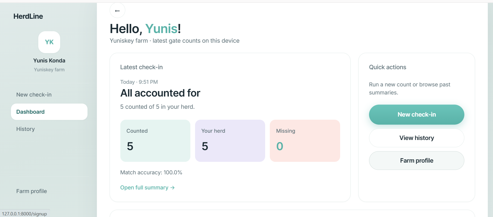
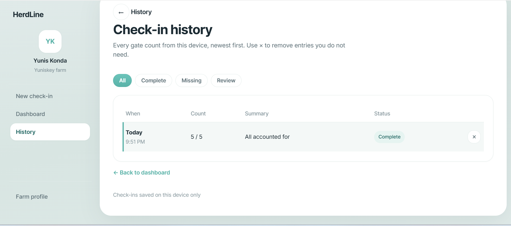

# HerdLine

HerdLine counts goats in a gate video. A farmer uploads a clip, says how many goats should be in the herd, and the app reports how many crossed a line and whether any look missing.

## GitHub

https://github.com/Yunis-konda001/herdLine

## What is in the project

- `notebooks/goat_detection_and_counting.ipynb` — data charts, model notes, and test-set scores
- `models/weights/best.pt` — the trained YOLOv8n detector
- `src/` — detection, tracking, and line counting
- `web/` — the website used for the demo
- `data/` — CherryChevre images and labels (train, valid, test)

## Setup

From the project folder, with the virtual environment turned on:

```bash
cd c:/capstone
.venv\Scripts\activate
pip install -r requirements.txt
```

You need Python 3 and the packages in `requirements.txt` (FastAPI, Ultralytics, OpenCV).

The goat images in `data/train`, `data/valid`, and `data/test` stay on this computer. They are about 9 GB, so they are not part of the GitHub upload. `data/goat.yaml` and the trained file `models/weights/best.pt` are included.

## Run the website

```bash
uvicorn web.app:app --reload --host 127.0.0.1 --port 8000
```

Open http://127.0.0.1:8000

What to click in a demo:

1. Farm profile — save a farm name and herd size (stored in the browser only).
2. New check-in — enter the herd size and upload a short gate video.
3. Summary — counted goats, missing or extra, and the annotated video.
4. History — earlier check-ins on this computer.

## Notebook

Open `notebooks/goat_detection_and_counting.ipynb`.

It shows the dataset, what YOLOv8n is, and the test-set scores. On the held-out test images the saved model scored about precision 0.90, recall 0.74, and F1 0.81. The training cell has already been run. Do not run it again unless you want to replace `best.pt`.

## Screenshots

Farm profile, new check-in, summary, and history.









## Deployment

This milestone runs on a laptop. The site is a local FastAPI app. Check-ins are saved in the browser (`localStorage`), not in a database.

A later version can use the same app on a small cloud server, with `best.pt` on that machine. No cloud host is set up yet.

## How a count is made

Video frames go through YOLOv8n and ByteTrack. A goat is counted once when its track crosses a line in the chosen direction. The total is compared with the herd size.
